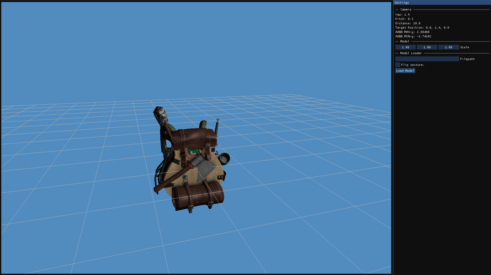

# Project Astra
### This is a project about making a game engine in the structure of an early 2000s MMO. (This is not an attempt for some large scale MMO)
### Currently features a custom map maker (TerrEdit another repo) with a custom file format for fast loading.
### And a model Viewer

## TODO
* Model Loader
* Mesh collisions

# Progress images
